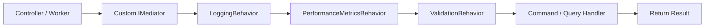
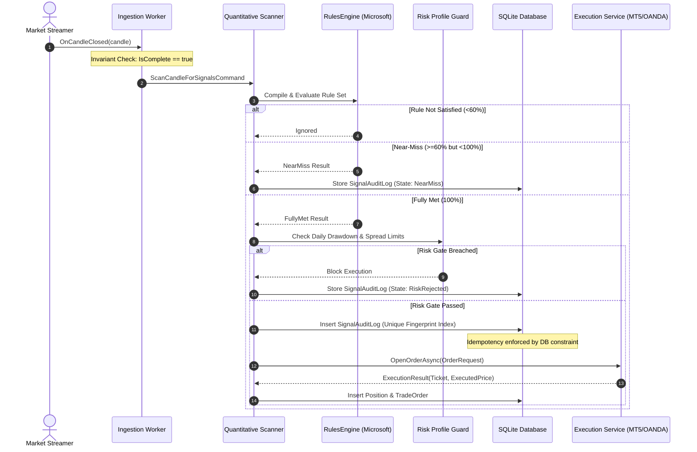

# System Architecture & Design Principles

The Trading Platform is designed around **Clean Architecture**, **CQRS (Command Query Responsibility Segregation)**, and **Hexagonal (Ports and Adapters)** principles. It separates domain logic from external data providers, brokers, and database technologies.

---

## 1. Architectural Layers & Project Structure

```text
TradingPlatform/
├── src/
│   ├── Core/
│   │   ├── TradingPlatform.Domain/              # Pure domain entities, value objects, domain events, business invariants
│   │   └── TradingPlatform.Application/         # Custom CQRS mediator, pipeline behaviors, commands, queries, custom validation, custom resilience
│   ├── Infrastructure/
│   │   ├── TradingPlatform.Persistence/         # EF Core DbContext, entity configurations, unique constraints, repositories
│   │   ├── TradingPlatform.RulesEngine/         # Microsoft.RulesEngine integration, React Query Builder compiler, Skender indicator calculator
│   │   ├── TradingPlatform.Broker.Abstractions/ # Ports: IMarketDataStreamer, IOrderExecutionService, IHistoricalDataProvider
│   │   ├── TradingPlatform.Broker.Public/       # Keyless adapters: Binance, Yahoo Finance Crumb Session, ECB Frankfurter, Composite failover
│   │   ├── TradingPlatform.Broker.Oanda/        # Broker adapter: OANDA v20 REST API + streaming HTTP client
│   │   ├── TradingPlatform.Broker.ZeroMQ/       # Broker adapter: NetMQ PUB/SUB & REQ/REP MT5 bridge
│   │   └── TradingPlatform.AI.Abstractions/     # Pluggable contracts for AI reasoning, vision verification, & embeddings
│   └── Presentation/
│       ├── TradingPlatform.Worker/              # BackgroundServices for candle ingestion, live scanning, and 10s heartbeat/kill switch
│       ├── TradingPlatform.Api/                 # Minimal API host exposing endpoints, WebSockets, and static frontend hosting
│       └── TradingPlatform.Web/                 # High-performance React 18 / TypeScript charting workstation
└── tests/
    ├── TradingPlatform.UnitTests/               # Unit test suite (CQRS, indicators, rules, resilience, validation)
    └── TradingPlatform.IntegrationTests/        # E2E pipeline integration tests and WebApplicationFactory tests
```

---

## 2. Hexagonal Ports & Adapters Architecture

The core domain does not know about specific broker APIs or data providers. All broker interactions are mediated through interfaces (Ports) defined in [`TradingPlatform.Broker.Abstractions`](file:///home/wb-sithole/.gemini/antigravity/scratch/TradingPlatform/src/Infrastructure/TradingPlatform.Broker.Abstractions):

```mermaid
flowchart TD
    subgraph Core Domain
        DomainEntities[Entities: Position, TradeOrder, Strategy]
        CQRS[Application Pipeline: Commands & Queries]
    end

    subgraph Ports (Abstractions)
        P1[IMarketDataStreamer]
        P2[IOrderExecutionService]
        P3[IHistoricalDataProvider]
    end

    subgraph Adapters (Implementations)
        A1[Keyless Composite Provider]
        A2[OANDA v20 Gateway]
        A3[MetaTrader 5 ZeroMQ Gateway]
        A4[Offline Simulation Sandbox]
    end

    CQRS --> P1
    CQRS --> P2
    CQRS --> P3

    A1 -.-> P1
    A1 -.-> P3
    A2 -.-> P1
    A2 -.-> P2
    A2 -.-> P3
    A3 -.-> P1
    A3 -.-> P2
    A3 -.-> P3
    A4 -.-> P1
    A4 -.-> P2
    A4 -.-> P3
```

### Core Interfaces:
- **`IMarketDataStreamer`**: Publishes live candle and tick events asynchronously (`OnCandleClosed`, `OnTickReceived`).
- **`IOrderExecutionService`**: Handles order dispatch (`OpenOrderAsync`), order closure (`CloseOrderAsync`), order protection modifications (`ModifyOrderAsync`), and open position inspection.
- **`IHistoricalDataProvider`**: Supplies historical candlestick series with pagination (`GetHistoricalCandlesAsync`, `GetHistoricalCandlesBeforeAsync`).

---

## 3. Custom CQRS Mediator & Pipeline Behaviors

The system avoids heavy third-party dependencies (such as MediatR or Wolverine) in favor of a lightweight, strongly typed Mediator pattern built directly into [`TradingPlatform.Application`](file:///home/wb-sithole/.gemini/antigravity/scratch/TradingPlatform/src/Core/TradingPlatform.Application):



### Chained Pipeline Interceptors:
1. **`LoggingBehavior<TRequest, TResponse>`**: Generates structured JSON log entries with request fingerprints, payloads, and caller context.
2. **`PerformanceMetricsBehavior<TRequest, TResponse>`**: Measures execution duration in milliseconds and logs high-priority warnings if execution exceeds 500ms.
3. **`ValidationBehavior<TRequest, TResponse>`**: Intercepts requests and evaluates fluent validation rules before invoking the handler, returning structured validation errors on failure.

---

## 4. End-to-End Signal Execution Lifecycle

When a bar closes, it flows through the scanning and execution pipeline:



---

## 5. Strict Operational Invariants

1. **Closed-Candle Guarantee**:
   The engine will never evaluate strategy rules against incomplete forming candles (`Candle.IsComplete == false`). Forming candles are only permitted on the charting interface for real-time visualization.
2. **Database-Enforced Idempotency**:
   Duplicate order prevention is enforced at the database schema level via a unique index on `SignalAuditLog.SignalFingerprint`:
   ```csharp
   $"{Symbol}_{Timeframe}_{CandleTimestampUtc:yyyyMMddHHmm}_{StrategyId}"
   ```
   Even under extreme concurrent message delivery, only one execution can commit.
3. **Continuous Equity Heartbeat & Kill Switch**:
   Every 10 seconds, [`KillSwitchWorker`](file:///home/wb-sithole/.gemini/antigravity/scratch/TradingPlatform/src/Presentation/TradingPlatform.Worker) polls active broker equity. If daily drawdown exceeds configured thresholds, the kill switch engages instantly: liquidating open positions and locking out automated execution.
