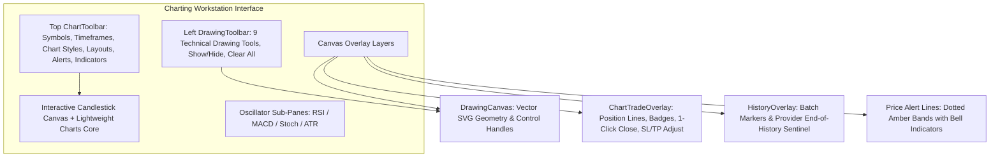

# TradingView-Challenging Charting Workstation

The platform features a high-performance, institutional-grade charting workstation built with **React 18**, **TypeScript**, and **Lightweight Charts**. It merges institutional analysis tools with direct broker execution capabilities.

---

## 1. Workstation Layout Overview



---

## 2. Dynamic Viewport & Zoom Lock (Zero-Jump History Loading)

A common flaw in web-based trading platforms is that loading older bars causes the chart to reset zoom or jump unexpectedly.

### How Our Viewport Locking Works:
1. **Separation of Series Data from Viewport State**:
   Live tick updates and older historical bar injections never destroy the series or invoke `.fitContent()`.
2. **Logical Index Offset Calculation**:
   When a new page of older bars is prepended on the left:
   ```typescript
   const prependedCount = cleanCandles.filter(
     (c) => getCandleTimeSeconds(c.timestamp) < prevInfo.earliestTime
   ).length;

   if (prependedCount > 0 && prevRange) {
     timeScale.setVisibleLogicalRange({
       from: prevRange.from + prependedCount,
       to: prevRange.to + prependedCount,
     });
   }
   ```
   Because every existing bar's logical index shifts right by `prependedCount`, adjusting the visible logical range by the exact same count keeps the candles under the user's cursor locked in place.
3. **History Load Markers**:
   Small down-arrow tags are placed on the exact bar where each historical page joined the dataset (e.g. `#1 +300 bars · total 600`), providing visual confirmation of history loading.

---

## 3. Persistent Technical Drawings (CRUD Across Sessions)

The drawing system supports 9 technical drawing tools with full CRUD persistence across browser sessions and symbol changes.

### Drawing Tools Available:
| Tool | Shortcut | Description |
| :--- | :---: | :--- |
| **Crosshair** | <kbd>C</kbd> | Standard inspection crosshair. |
| **Trend Line** | <kbd>T</kbd> | 2-point anchored diagonal line with slope and pip delta. |
| **Horizontal Line** | <kbd>H</kbd> | Support / Resistance level spanning the entire chart. |
| **Horizontal Ray** | <kbd>R</kbd> | Breakout ray extending infinitely to the right. |
| **Fibonacci Retracement** | <kbd>F</kbd> | Golden pocket levels (0.236, 0.382, 0.5, 0.618, 0.786). |
| **Order Block / Zone** | <kbd>Z</kbd> | Demand and supply rectangular zones. |
| **Long Position** | <kbd>L</kbd> | Target price, stop loss, and risk-to-reward ratio calculator. |
| **Short Position** | <kbd>S</kbd> | Short risk-to-reward ratio calculation box. |
| **Measurement Ruler** | <kbd>M</kbd> | Pips delta, percentage change, and bar count measurement. |

### Persistence Mechanism:
```mermaid
flowchart LR
    User[Trader Draws / Modifies] --> State[drawingsMap State in React]
    State --> Local[localStorage: tradingview_drawings_v2]
    State --> Remote[POST /api/chart-drawings/{symbol}]
    
    SymbolSwitch[Switch Symbol to BTCUSDT] --> Load[Load BTCUSDT Drawings]
    Load <-- ReadLocal[localStorage]
    Load <-- ReadRemote[GET /api/chart-drawings/BTCUSDT]
```

- Drawings are **anchored by time and price coordinates** (`{ time: unixSeconds, price: decimal }`), ensuring they maintain geometry during zoom and pan operations.
- Selecting any drawing displays an inline formatting toolbar allowing instant adjustment of line color (White, Cyan, Orange, Green, Purple, Red), line width (1px, 2px, 3px), and style (Solid, Dashed, Dotted).

---

## 4. Visual Order & Position Chart Overlays

The platform allows traders to monitor and manage open orders directly on the chart canvas via [`ChartTradeOverlay.tsx`](file:///home/wb-sithole/.gemini/antigravity/scratch/TradingPlatform/src/Presentation/TradingPlatform.Web/src/components/chart/ChartTradeOverlay.tsx).

```mermaid
flowchart TD
    subgraph On-Chart Position Visualization
        EntryLine[Entry Price Line: Colored Dashed Line]
        Badge[Position Badge: BUY 0.50L @ 1.08520 | +$142.50 (+18.2p)]
        CloseBtn[1-Click Close Button: ✕ Close]
        SLLine[Stop Loss Line: Red Dashed Band + Pip Distance]
        TPLine[Take Profit Line: Green Dashed Band + Pip Distance]
        Zones[Shaded Translucent Green Profit & Red Loss Zones]
    end

    EntryLine --> Badge
    Badge --> CloseBtn
    Badge --> SLLine
    Badge --> TPLine
```

### Key Capabilities:
1. **Interactive Entry Line**:
   Renders at the exact entry price coordinate with order side, lot size, entry price, and real-time floating profit/loss (`+$142.50 (+18.2 pips)`).
2. **Direct On-Chart Close**:
   Clicking the **`[✕ Close]`** button on the badge immediately triggers broker order liquidation without leaving the chart.
3. **Stop Loss (SL) & Take Profit (TP) Adjustment**:
   Click the **`Edit`** button on any position badge to open the protection popover, enter new SL/TP values, and click **`Apply`**. This calls `POST /api/positions/{ticket}/modify` and updates the broker and database.
4. **1-Click Quick Execution Pill**:
   Floating execution widget in the top-left corner:
   `SELL [Bid]` | `[Lots Input: 0.10]` | `BUY [Ask]`. Instant single-click market execution with live spread calculation.

---

## 5. Multi-Chart Grid Layouts (Multi-Timeframe Analysis)

Traders can split the workstation into multiple concurrent charts using [`ChartToolbar.tsx`](file:///home/wb-sithole/.gemini/antigravity/scratch/TradingPlatform/src/Presentation/TradingPlatform.Web/src/components/chart/ChartToolbar.tsx) and [`SecondaryChartPane.tsx`](file:///home/wb-sithole/.gemini/antigravity/scratch/TradingPlatform/src/Presentation/TradingPlatform.Web/src/components/chart/SecondaryChartPane.tsx):

```text
+-----------------------+-----------------------+
|  Slot 0 (Primary)     |  Slot 1 (Secondary)   |
|  EURUSD · H1          |  EURUSD · M5          |
|  (Full Drawings & UI) |  (Independent Stream) |
+-----------------------+-----------------------+
|  Slot 2 (Secondary)   |  Slot 3 (Secondary)   |
|  EURUSD · D1          |  EURUSD · M1          |
|  (Macro Trend)        |  (Sniper Entry)       |
+-----------------------+-----------------------+
```

### Supported Layouts:
1. `[ 1 ]` **Single Chart**: Standard single-pane view.
2. `[ | ]` **Dual Vertical Split**: Side-by-side (50% / 50% width).
3. `[ = ]` **Dual Horizontal Split**: Stacked (50% / 50% height).
4. `[ ⊞ ]` **Quad 2x2 Grid**: 4 independent timeframe charts simultaneously.

Each secondary pane features:
- Independent symbol selection and timeframe selector pills (`1m`, `5m`, `15m`, `1h`, `4h`, `1D`).
- Live candle polling and technical overlays (EMA 20).
- **Maximize Button**: Expands any secondary pane to full-screen mode instantly.

---

## 6. Interactive Price Level Alerts & Web Audio Chimes

Traders can set alerts on key breakout levels or support/resistance zones.

### How It Works:
1. **Alert Creation Dialog ([`ChartAlertsModal.tsx`](file:///home/wb-sithole/.gemini/antigravity/scratch/TradingPlatform/src/Presentation/TradingPlatform.Web/src/components/chart/ChartAlertsModal.tsx))**:
   Click **`🔔 Alerts`** in the toolbar to create an alert. Configure target price, condition (`Crosses Above`, `Crosses Below`, `Crosses Any`), and custom label.
2. **Visual Alert Lines on Chart**:
   Active alerts appear as dotted amber horizontal lines on the chart series and price axis with a bell badge.
3. **Live Cross Evaluation**:
   On every incoming tick or candle update, the engine compares the previous price against the current price. When a level is breached:
   - **Zero-Dependency Web Audio Chime ([`audioAlert.ts`](file:///home/wb-sithole/.gemini/antigravity/scratch/TradingPlatform/src/Presentation/TradingPlatform.Web/src/utils/audioAlert.ts))**: Synthesizes a crisp two-tone alert chime (A5 880Hz → E6 1318.5Hz) using the browser's native AudioContext. Works 100% offline without external audio files.
   - **Animated Toast Banner**: An animated alert notification bounces onto the screen detailing the symbol, target price, and note.

---

## 7. Dashboard Mini Chart & Advanced Charting Gateway

The main mission control dashboard integrates a live mini chart component ([`DashboardMiniChart.tsx`](file:///home/wb-sithole/.gemini/antigravity/scratch/TradingPlatform/src/Presentation/TradingPlatform.Web/src/components/DashboardMiniChart.tsx)) that acts as an interactive preview and direct gateway to the full workstation:

### Features:
1. **Live Candlestick / Area Sparkline Preview**:
   - Renders live market data using the core Lightweight Charts engine.
   - Shows active symbol, asset category, current market price, price delta, and 24h high/low.
   - Toggles dynamically between Candlesticks and smooth Area gradient views.
   - Overlays an EMA 20 trend line directly on the mini canvas.
2. **Quick Asset & Timeframe Switcher**:
   - One-click asset chips (`EURUSD`, `GBPUSD`, `USDJPY`, `BTCUSD`, `ETHUSD`, `XAUUSD`, `US500`).
   - Granular timeframe selectors (`M1`, `M5`, `M15`, `H1`, `D1`).
3. **Seamless Gateway to Full Workstation**:
   - Prominent **"Open Advanced Chart"** call-to-action button.
   - Full chart canvas is interactive and clickable: clicking anywhere on the mini chart opens the full Workstation for that exact symbol and timeframe.
   - Hover preview banner highlights the 15+ indicators, smart drawing suite, and multi-pane capabilities.
4. **Advanced Capabilities Showcase Ribbon**:
   - Displays clear feature badges directly below the mini chart to educate traders on the deep capabilities available in the full workstation (15+ Technical Indicators, Institutional Drawing Suite, Dual Split Multi-Timeframe Views, and On-Chart Drag-and-Drop Order Execution).

