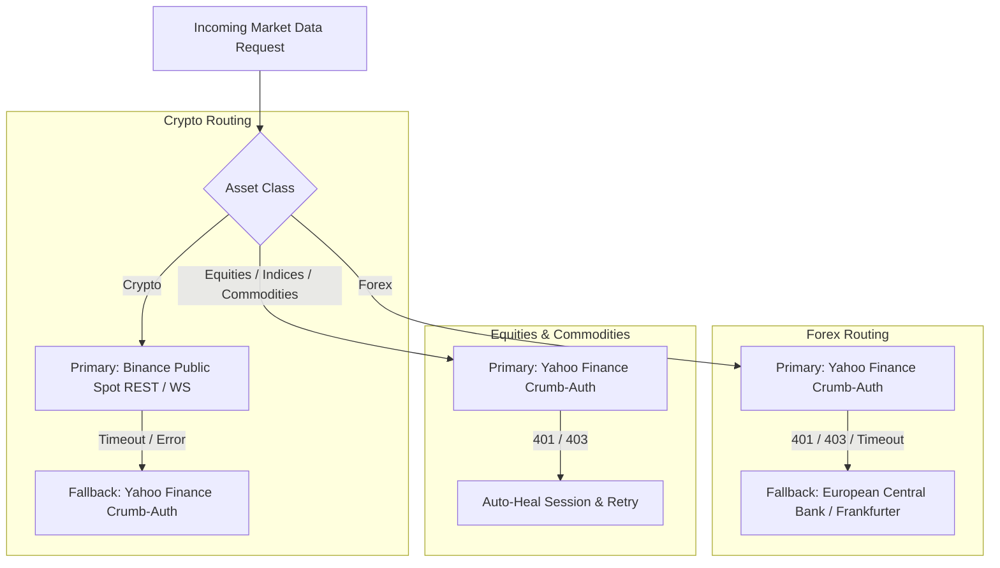
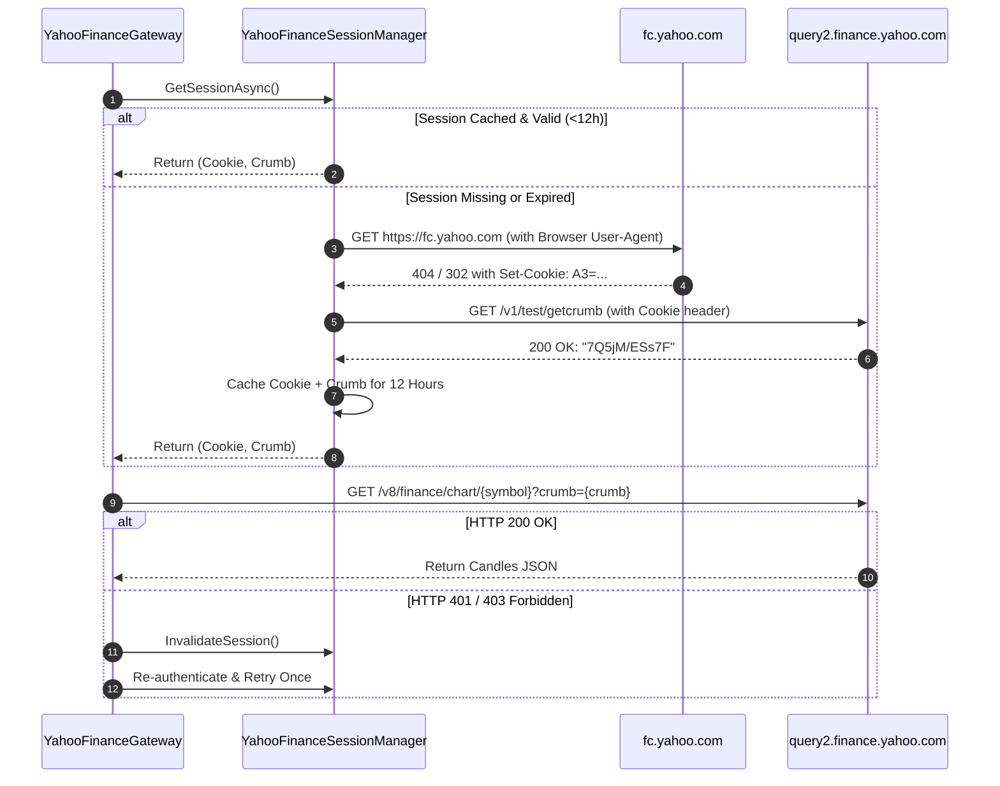

# Market Data Providers & Auto-Failover Circuit

The platform is designed to provide **100% out-of-the-box market data coverage** across Crypto, Forex, Stocks, Indices, and Commodities without requiring paid broker API keys or subscriptions.

---

## 1. Provider Routing Architecture

Market data requests are managed by [`CompositeMarketDataProvider.cs`](file:///home/wb-sithole/.gemini/antigravity/scratch/TradingPlatform/src/Infrastructure/TradingPlatform.Broker.Public/CompositeMarketDataProvider.cs), which dynamically routes requests based on asset class and feed health:



---

## 2. Yahoo Cookie & Crumb Session Manager

### Why Is This Necessary?
Yahoo Finance's `query1/query2.finance.yahoo.com/v8/finance/chart` endpoints are internal backend APIs designed for web browsers. They do not offer an official public SLA and actively enforce anti-scraping challenges:
- Direct, unauthenticated requests return `HTTP 401 Unauthorized` or `HTTP 403 Forbidden`.
- Yahoo requires a valid browser session cookie (`A3`, `A1`, `EuConsent`) paired with a dynamic `crumb` token passed in the query string (`&crumb=...`).

### The Two-Stage Authentication Handshake:
Implemented in [`YahooFinanceSessionManager.cs`](file:///home/wb-sithole/.gemini/antigravity/scratch/TradingPlatform/src/Infrastructure/TradingPlatform.Broker.Public/YahooFinanceSessionManager.cs):



### Key Technical Features:
1. **Desktop Browser Fingerprinting**: Injects authentic headers (`User-Agent`, `sec-ch-ua`, `sec-ch-ua-platform: "Windows"`, `Accept-Language: en-US,en;q=0.9`) to prevent bot detection heuristics.
2. **Thread-Safe Caching**: Uses `SemaphoreSlim` double-checked locking so concurrent requests share a single authentication handshake without rate-limit spamming.
3. **Transparent Auto-Healing**: If Yahoo invalidates the crumb mid-session, the gateway detects the 401/403 status, invalidates the cache, requests a fresh session, and replays the request seamlessly.

---

## 3. European Central Bank (ECB) Frankfurter Public Gateway

To ensure Forex trading never halts when Yahoo is unreachable, we built [`FrankfurterPublicGateway.cs`](file:///home/wb-sithole/.gemini/antigravity/scratch/TradingPlatform/src/Infrastructure/TradingPlatform.Broker.Public/FrankfurterPublicGateway.cs):

- **Zero-Key Open-Source API**: Fetches official reference rates published daily by the **European Central Bank (ECB)** via `https://api.frankfurter.dev/v1/latest` (with automatic fallback to `api.frankfurter.app`).
- **Candle Synthesis**: When primary Forex feeds degrade, the gateway synthesizes continuous intraday candles around the official ECB benchmark reference rate, preserving chart continuity.

---

## 4. Binance Public Spot Gateway

For Cryptocurrency pairs (`BTCUSDT`, `ETHUSDT`, `SOLUSDT`, `BNBUSDT`, etc.):

- **Direct Public API**: Connects to `https://api.binance.com/api/v3/klines` without any API keys or account registration.
- **Granular OHLCV**: Delivers institutional tick-by-tick precision, volume metrics, and multi-timeframe candle data (`1m`, `5m`, `15m`, `1h`, `4h`, `1d`).

---

## 5. Feed Health & Observability Endpoints

The system exposes real-time health and failover metrics:

### `GET /api/market-data/health`
Returns current session status, active crumb preview, and failover state:
```json
{
  "status": "Healthy",
  "isFailoverEngaged": false,
  "activeFailoverProvider": null,
  "lastFailoverReason": null,
  "lastFailoverUtc": null,
  "yahooSession": {
    "hasActiveSession": true,
    "crumbPreview": "7Q5jM/...",
    "ageMinutes": 2.4
  }
}
```

### `GET /api/market-data/providers`
Lists all available data providers (Keyless Public, OANDA v20, MetaTrader 5 ZeroMQ, and Synthetic Sandbox) with configuration status and supported timeframes.
