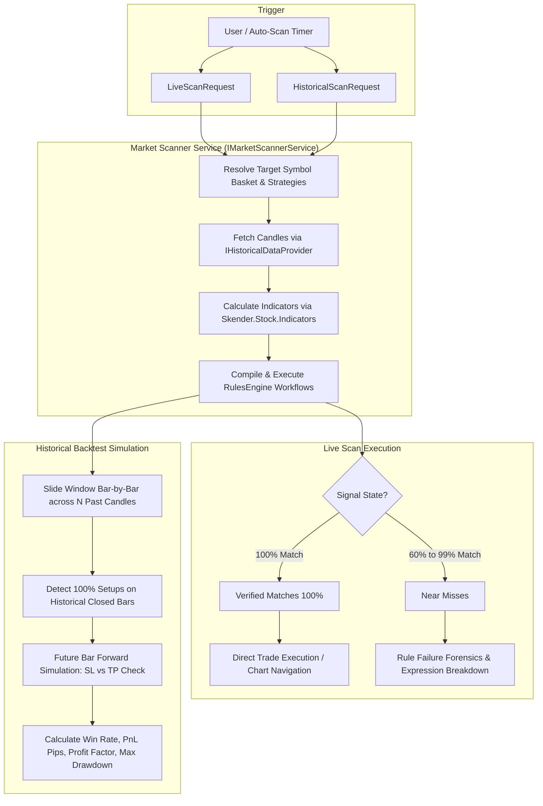

# Robotic Market Scanner & Historical Backtester

The **Market Scanner Robot** is a core robotic capability within the trading platform designed for systematic, high-frequency technical setup discovery and quantitative historical verification across user-defined symbol buckets.

---

## 🎯 Architecture & Guiding Principles

### 1. Targeted Symbol Buckets (No Global Carelessness)
Rather than scanning thousands of symbols globally—which introduces severe rate limits, latency bottlenecks, and low-probability setups—the system organizes symbols into **Categorized Buckets / Baskets**:

- **Forex Majors** (`EURUSD`, `GBPUSD`, `USDJPY`, `AUDUSD`, `USDCAD`, `USDCHF`, `NZDUSD`)
- **Forex Crosses** (`EURGBP`, `EURJPY`, `GBPJPY`, `AUDJPY`, `EURAUD`, `GBPAUD`)
- **Top Crypto Baskets** (`BTCUSDT`, `ETHUSDT`, `SOLUSDT`, `BNBUSDT`, `XRPUSDT`, `ADAUSDT`)
- **US Tech Giants** (`AAPL`, `MSFT`, `NVDA`, `TSLA`, `AMZN`, `GOOGL`, `META`, `AMD`)
- **Global Indices** (`US500`, `NAS100`, `US30`, `GER40`, `UK100`, `JP225`)
- **Precious Metals & Energy** (`XAUUSD`, `XAGUSD`, `USOIL`, `UKOIL`, `NATGAS`)
- **Custom User Baskets**: Full flexibility to define custom combinations with designated strategy assignments.

### 2. Closed-Candle Invariant
The scanner strictly enforces the closed-candle invariant: **indicator calculation and rule evaluations only trigger on closed bars**. Unfinished, forming bars are never used for rule matching to eliminate false repainting.

---

## 🔄 Scanning Pipelines

---

## ⚡ Live Market Scanner

The Live Market Scanner evaluates every symbol in the target bucket simultaneously using parallel task concurrency (`MaxDegreeOfParallelism = 4`).

### Verified Matches vs Near-Misses
The scanner bifurcates findings into two actionable tiers:

| Tier | Pass Ratio | Description | Action |
| :--- | :--- | :--- | :--- |
| **Verified Match** | **100%** | Every rule condition in the strategy is satisfied on the latest closed candle. | Execute robot trade immediately or open chart. |
| **Near Miss** | **60% – 99%** | The vast majority of rules passed (e.g. 2 of 3, 3 of 4), but one or two conditions fell short. | Monitor closely; provides exact failure reason and condition values. |

### Dynamic SL / TP Computation
When a signal triggers, entry and exit brackets are dynamically derived using Average True Range (ATR 14):
$$\text{Stop Loss} = \text{Entry} \mp (1.5 \times \text{ATR}_{14})$$
$$\text{Take Profit} = \text{Entry} \pm (3.0 \times \text{ATR}_{14})$$

---

## 🔬 Historical Bar Backtester

The historical backtester runs the strategy against past history bars (50 to 500 bars) across any selected symbol bucket.

### Forward Bar-by-Bar Trade Resolution
1. **Warm-up**: The first 30 bars warm up EMAs, RSI, MACD, Bollinger Bands, and ATR.
2. **Sliding Window**: At each historical candle $i$, the indicators are calculated on the window $[i - 80, i]$.
3. **Trigger**: If a 100% verified match occurs, a simulated trade opens at $\text{Close}_i$.
4. **Resolution Simulation**: Subsequent future bars $k = i + 1, i + 2, \dots$ are evaluated:
   - For **Buy**: If $\text{High}_k \ge \text{TakeProfit}$ $\rightarrow$ **Win**; if $\text{Low}_k \le \text{StopLoss}$ $\rightarrow$ **Loss**.
   - For **Sell**: If $\text{Low}_k \le \text{TakeProfit}$ $\rightarrow$ **Win**; if $\text{High}_k \ge \text{StopLoss}$ $\rightarrow$ **Loss**.
   - If both trigger on the same bar, the conservative outcome (**Loss**) is assigned.
   - If neither triggers before the end of the history, the trade is marked as **Open** and marked to market at the final close.

### Key Performance Indicators (KPIs)
The backtester generates an institutional performance summary:
- **Win Rate %**: $\frac{\text{Winning Trades}}{\text{Closed Trades}} \times 100$
- **Total Net P&L**: Sum of profit/loss in pips and estimated dollar amounts based on a 1 standard lot baseline ($10/pip).
- **Profit Factor**: $\frac{\sum \text{Gross Profits}}{\sum |\text{Gross Losses}|}$
- **Max Drawdown**: Peak-to-trough maximum equity dip in pips.
- **Interactive Trade Timeline**: Complete log with entry time, exit time, entry price, exit price, and pip delta.

---

## 📡 REST API Endpoints

### Symbol Groups (Buckets)
- `GET /api/symbol-groups`: Retrieve all saved symbol buckets.
- `GET /api/symbol-groups/{id}`: Retrieve a specific symbol bucket by ID.
- `POST /api/symbol-groups`: Create a new custom symbol bucket.
- `PUT /api/symbol-groups/{id}`: Update an existing symbol bucket.
- `DELETE /api/symbol-groups/{id}`: Delete a symbol bucket.

### Market Scanner
- `POST /api/scanner/live`: Execute a live scan across a bucket or list of symbols.
- `POST /api/scanner/historical`: Run a historical closed-bar backtest across $N$ past candles.
