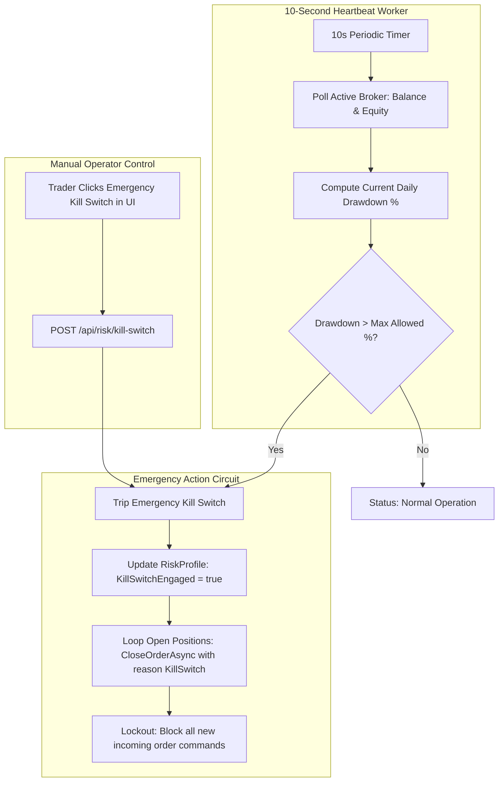

# Risk Management & Emergency Kill Switch

Capital preservation is the foundation of the platform. The system implements continuous automated account monitoring, strict pre-trade gatekeeping, and an emergency liquidation circuit.

---

## 1. Risk Management Architecture



---

## 2. 10-Second Equity Heartbeat Monitor

Implemented in [`KillSwitchWorker.cs`](file:///home/wb-sithole/.gemini/antigravity/scratch/TradingPlatform/src/Presentation/TradingPlatform.Worker):

1. **Continuous Verification**:
   Runs as an independent background service every 10 seconds, querying the active broker (`OandaGateway` or `ZeroMqGateway`) for live account equity.
2. **Dynamic Drawdown Calculation**:
   ```csharp
   decimal drawdownPct = ((balance - equity) / balance) * 100m;
   if (drawdownPct >= profile.MaxDailyDrawdownPercent)
   {
       _logger.LogCritical("[KILL SWITCH ENGAGED] Max daily drawdown reached ({Current}% >= {Max}%). Liquidating positions.",
           drawdownPct, profile.MaxDailyDrawdownPercent);
       
       await mediator.Send(new EngageKillSwitchCommand("Automated daily drawdown limit breached"));
   }
   ```
3. **Fail-Safe Operation**:
   If the broker connection drops or times out repeatedly, the circuit marks the account state as degraded and raises alerts on the management dashboard.

---

## 3. The Emergency Kill Switch

The Kill Switch can be engaged automatically (by the equity heartbeat) or manually by the operator via the **Kill Switch Modal** in the UI:

### Actions Performed When Engaged:
1. **Immediate Order Liquidation**:
   Iterates through all open broker tickets and dispatches instant market close commands:
   ```csharp
   foreach (var position in openPositions)
   {
       await broker.CloseOrderAsync(position.TicketId, "EmergencyKillSwitch_Engaged", ct);
   }
   ```
2. **Database State Synchronization**:
   Marks all open positions and orders in SQLite as `Closed` with `ExitReason.KillSwitch`.
3. **Execution Lockout**:
   All subsequent order placement commands (`PlaceOrderCommand`, `ScanCandleForSignalsCommand`) are intercepted and rejected immediately at the CQRS pipeline level before reaching the broker adapter.

### Disengaging the Kill Switch:
To restore trading after market stabilization:
- Open the **Risk Console** or **Kill Switch Modal** in the UI.
- Click **"Disengage Kill Switch"** (or send `POST /api/risk/kill-switch` with `{"engage": false}`).
- The system resets the lockout flag and resumes automated scanning.

---

## 4. Pre-Trade Gatekeeping & Spread Filters

Before any order is dispatched, it must pass validation checks:

- **Spread Gate**: Configurable max spread limits per symbol (e.g. max 1.5 pips for `EURUSD`, max 3.5 pips for `GBPUSD`). If spread widens during major news releases (NFP, CPI, rate announcements), the trade is rejected.
- **Maximum Open Positions**: Caps total portfolio exposure across all active strategies.
- **Exposure Cap Per Symbol**: Restricts simultaneous long and short exposure on correlated assets.
