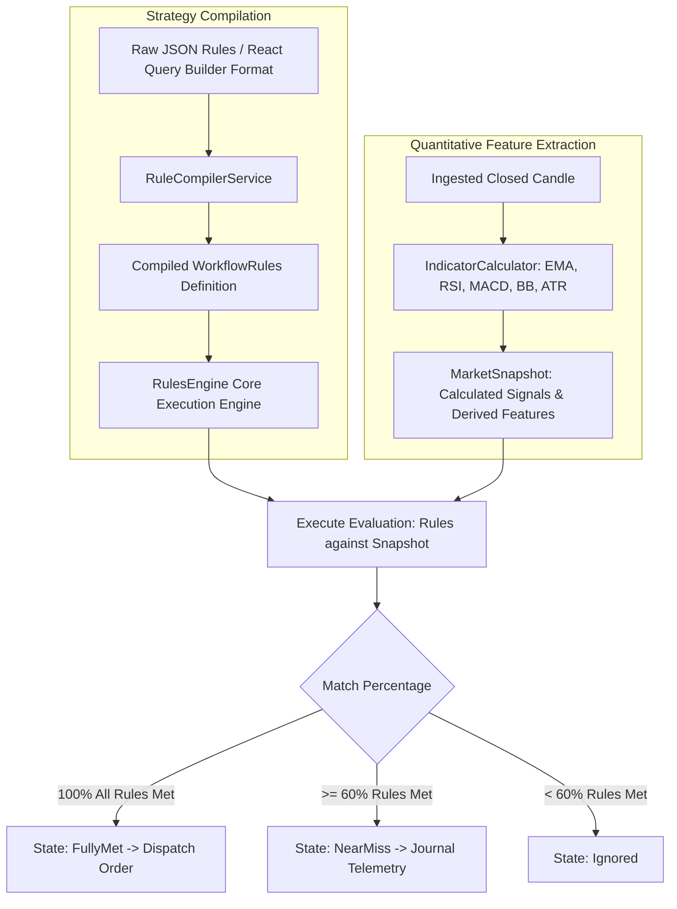

# Rule Engine, Strategy Studio & Autonomous Bots

The platform contains a quantitative rule engine and background execution framework designed for algorithmic trading across multiple timeframes.

---

## 1. Strategy Compilation & Evaluation Engine

The rule engine resides in [`TradingPlatform.RulesEngine`](file:///home/wb-sithole/.gemini/antigravity/scratch/TradingPlatform/src/Infrastructure/TradingPlatform.RulesEngine) and integrates **Microsoft.RulesEngine** with a bidirectional compiler supporting React Query Builder schemas.



---

## 2. Multi-Stage Evaluation & Near-Miss Telemetry

Unlike traditional black-box bots that discard failed conditions silently, the platform implements **deterministic multi-stage evaluation**:

1. **`FullyMet` (100% Condition Satisfaction)**:
   All defined conditions are met. Triggers risk validation and order execution via the active broker.
2. **`NearMiss` ($\ge 60\%$ Condition Satisfaction)**:
   The market closely resembled the setup, but one or more secondary criteria failed (e.g. RSI crossed 68 instead of 70, or ATR was below threshold).
   - The engine logs a structured audit entry in `SignalAuditLogs`.
   - Records the exact failed condition, actual values, and expected values.
   - Displayed live on the **Near-Miss Radar** tab in the UI to help quantitative traders identify bottlenecks in their strategy rules.
3. **`Ignored` ($< 60\%$ Satisfaction)**:
   No setup detected; discarded without consuming persistence I/O.

---

## 3. The 100% Invariant: Closed-Candle Rule

> [!IMPORTANT]
> **The engine will NEVER execute an automated trade on an incomplete (forming) candle.**

### The Problem with Real-Time Ticks:
Intra-bar price fluctuations produce false breakouts, repaint indicators, and trigger whipsaw entries. A candle that appears to break an EMA midway through its 5-minute duration may reverse and close below the line.

### How Our Engine Enforces This:
1. Every ingested bar is inspected by the ingestion pipeline:
   ```csharp
   if (!candle.IsComplete)
   {
       // Incomplete candle: forwarded to UI chart streams only, blocked from rule evaluation
       return;
   }
   ```
2. Strategy evaluation occurs **only once per candle close**, ensuring deterministic backtest-to-live consistency.

---

## 4. Idempotency & Duplicate Execution Guards

In high-throughput distributed setups, network glitches or worker restarts can cause identical candle close events to be emitted multiple times.

### Database-Enforced Fingerprinting:
To prevent duplicate orders, every evaluation produces a deterministic fingerprint:
```csharp
string fingerprint = $"{symbol}_{timeframe}_{candleTimestampUtc:yyyyMMddHHmm}_{strategyId}";
```

- A **unique database index** is enforced on `SignalAuditLog.SignalFingerprint` in SQLite / EF Core:
  ```csharp
  modelBuilder.Entity<SignalAuditLog>()
      .HasIndex(e => e.SignalFingerprint)
      .IsUnique();
  ```
- If parallel workers attempt to process the exact same candle close event for the same strategy, the second transaction is rejected with a unique constraint violation, preventing duplicate orders.

---

## 5. Built-In Technical Indicators Library

The platform incorporates technical indicators calculated natively via [`IndicatorCalculator`](file:///home/wb-sithole/.gemini/antigravity/scratch/TradingPlatform/src/Infrastructure/TradingPlatform.RulesEngine):

| Indicator | Implementation | Typical Rule Fields |
| :--- | :--- | :--- |
| **EMA / SMA** | Exponential & Simple Moving Averages | `ema20`, `ema50`, `ema200`, `price_crosses_ema` |
| **RSI** | Relative Strength Index (Wilder smoothed) | `rsi14`, `rsi_oversold`, `rsi_overbought` |
| **MACD** | Moving Average Convergence Divergence | `macd_line`, `macd_signal`, `macd_histogram` |
| **Bollinger Bands** | 20-period moving average with 2.0 std dev | `bb_upper`, `bb_lower`, `bb_percent_b` |
| **ATR** | Average True Range | `atr14`, dynamic SL/TP pip buffers |
| **Supertrend** | ATR multiplier-based trend filter | `supertrend_direction`, `supertrend_value` |
| **VWAP** | Volume Weighted Average Price | `vwap`, price deviation bands |
| **Ichimoku** | Tenkan-sen, Kijun-sen, Senkou Span A & B | `tenkan_cross_kijun`, `kumo_cloud_filter` |
